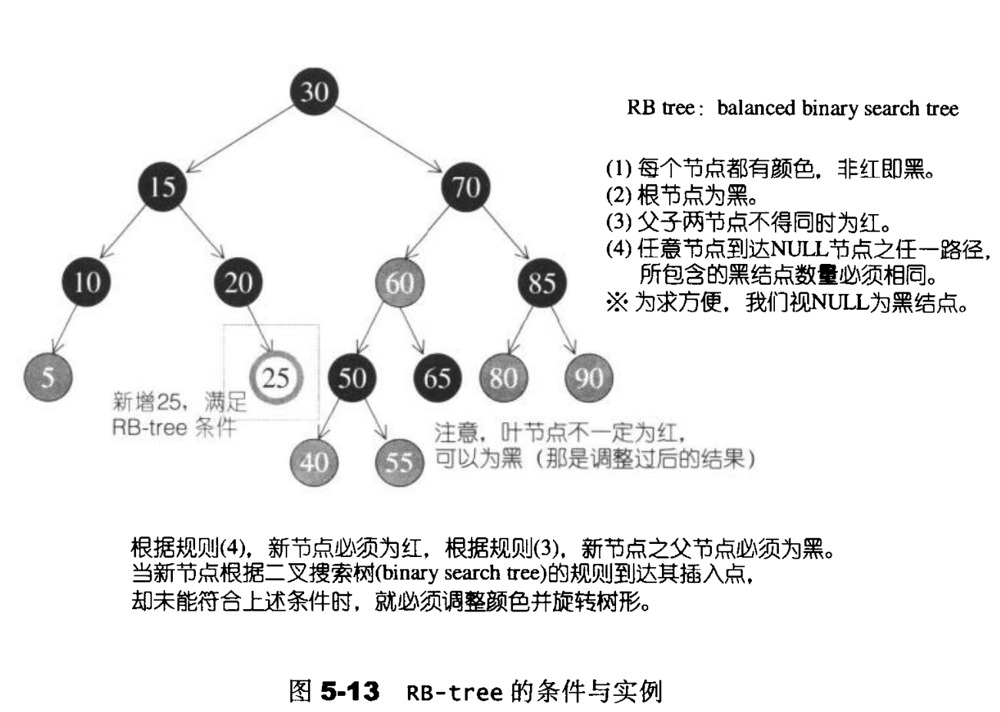

- [关联容器](#关联容器)
- [关联容器的实现](#关联容器的实现)
- [迭代器失效](#迭代器失效)
- [关联式容器的注意事项](#关联式容器的注意事项)
- [参考](#参考)

# 关联容器

关联容器实现能快速查找（ O(log n) 复杂度）的数据结构。

关联容器有以下几种

- set：有序集合，键唯一
- map：键值对集合，键唯一
- multiset：键集合，键不唯一
- multimap：键值对集合，键不唯一

# 关联容器的实现

关联容器的内部由红黑树实现，红黑树是一颗平衡的二叉搜索树（BST，Binary Search Tree）

在二叉搜索树中，任何节点的值一定大于左子树每一个节点的键值，小于右子树中每一个节点的键值

但是在极端的情况下，二叉搜索树可能失去平衡，退化为一个链表，造成查找效率低下。因此出现了平衡二叉搜索树，如AVL-tree，红黑树等

STL的红黑树实现中，会提供两个函数insert_unique和insert_equal分别来实现set/map和multiset/multimap

由于实现的特性，关联式容器是根据键值有序的，默认从小到大排序（使用std::less<T>进行比较）

# 迭代器失效

关联容器的迭代器和引用除了元素被删除外不会被非法化（包括end迭代器）

# 关联式容器的注意事项

- map的operator[]可能会新增元素
- 关联式容器实现了lower_bound，upper_bound和equal_range的成员函数
  - 使用通用的lower_bound，upper_bound和equal_range函数会导致查找效率变低（用在非随机存取迭代器上都会导致效率变低）
- 删除元素时注意迭代器失效的问题；代码`map.erase(it); it++;`是错误的
- 无法通过迭代器修改键值，但可以修改map/multimap的value值

# 参考

- [容器库](https://zh.cppreference.com/w/cpp/container)
- [STL源码剖析](https://item.jd.com/11821611.html)
