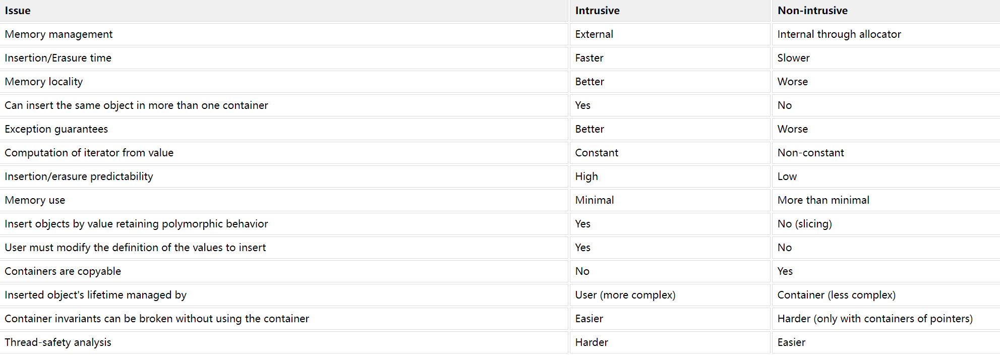

- [STL容器概述](#stl容器概述)
- [顺序容器](#顺序容器)
- [关联容器](#关联容器)
- [无序关联容器](#无序关联容器)
- [容器适配器](#容器适配器)
- [侵入式容器和非侵入式容器](#侵入式容器和非侵入式容器)
  - [非侵入式容器的缺点](#非侵入式容器的缺点)
  - [侵入式容器的优点](#侵入式容器的优点)
  - [侵入式容器的缺点](#侵入式容器的缺点)
- [参考](#参考)

# STL容器概述

容器被设计来存储数据，可以使程序员简单的访问常见的数据结构

每种不同的容器底层使用不同的数据结构，并拥有不同的特征，可在特定场景提供高效的数据存储和访问的方式

每种容器提供[迭代器](iterator.md)来访问存储在其中的元素

容器一般分为以下几种类别

# 顺序容器

顺序容器实现能按顺序访问的数据结构

- array：静态连续数组
- vector：动态连续数组
- deque：双端队列
- forward_list：单链表
- list：双链表

# 关联容器

关联容器实现能快速查找（ O(log n) 复杂度）的数据结构。

- set：有序集合，键唯一
- map：键值对集合，键唯一
- multiset：键集合，键不唯一
- multimap：键值对集合，键不唯一

# 无序关联容器

无序关联容器提供能快速查找（均摊 O(1) ，最坏情况 O(n) 的复杂度）的无序（哈希）数据结构。

- unordered_set：无序集合，键唯一
- unordered_map：无序键值对集合，键唯一
- unordered_multiset：无序集合，键不唯一
- unordered_multimap：无序键值对集合，键不唯一

# 容器适配器

容器适配器提供顺序容器的不同接口

- stack：栈
- queue：队列
- priority_queue：优先队列

# 侵入式容器和非侵入式容器

STL实现的容器都是非侵入式容器，通过模板类可以放入任何类型的结构，与浸入式容器的最大不同是，C++的非侵入式容器必须存储用户数据的拷贝

以链表为例，会分配一个包含数据和前后指针的节点存储用户数据，用户传入的对象和存储的对象不同

```cpp
// 要实现一个通用的链表需要使用模板类
template <class T>
struct ListNode {
  ListNode* prev;
  ListNode* next;
  T data;
};

int main()
{
   std::list<MyClass> myclass_list;

   MyClass myclass(...);
   myclass_list.push_back(myclass);

   //The stored object is different from the original object
   assert(&myclass != &myclass_list.front());
   return 0;
}
```

而对于浸入式容器，它们存储的是对象自身，如果希望将对象加入容器，则需额外提供附加的数据，例如对于链表来说需要在结构中加入前后指针

linux内核中就实现了一些侵入式的容器，如list和红黑树

在Boost.Intrusive库中，也实现了一些侵入式容器

```cpp
class MyClass
{
   MyClass *next;
   MyClass *previous;
   //Other members...
};

int main()
{
   acme_intrusive_list<MyClass> list;

   MyClass myclass;
   list.push_back(myclass);

   //"myclass" object is stored in the list
   assert(&myclass == &list.front());
   return 0;
}
```

## 非侵入式容器的缺点

- 一个对象只能属于一个容器：如果希望在两个容器里共享，要么存储这个对象的多个副本或这存储对象的指针(如std::list<T*>)
- 在某些情况下，使用动态内存分配对象的副本可能是性能的瓶颈
- 在 C++11 之前，只能将对象的副本存储在非侵入式容器中。仍然需要复制或移动构造函数和复制或移动赋值运算符，并且不可复制和不可移动的对象不能存储在某些容器中。在任何情况下，都必须使用构造函数在容器内创建新对象，并且不能在两个容器之间共享同一个对象。
- 无法保留原始类型的同时将派生对象存储在STL容器中

## 侵入式容器的优点

- 使用侵入式容器不会调用任何内存分配，与动态内存相关的时间开销可以最小化
- 使用很小的代价就可以将同一个对象同时插入多个容器中
- 迭代速度更快：相比于侵入式的迭代器，非侵入容器需要更少的内存访问
- 侵入式容器比非侵入式容器提供更好的异常保证。在某些情况下，侵入式容器提供了非侵入式容器无法提供的无异常抛出保证
- 从指针或对元素的引用到元素的迭代器的计算是恒定时间操作（计算 T* 在 std::list<T*> 中的位置具有线性复杂性）
- 因为侵入式容器没有进行内存管理，侵入式容器在插入和擦除对象时的成本具有可预测性。内存管理通常是不可预测的操作，因此非侵入式容器的复杂性保证比侵入式容器提供的保证更宽松。

## 侵入式容器的缺点

- 存储在侵入式容器中的每种类型都需要额外的内存来保存容器所需的维护信息。因此，无论何时将某种类型存储在侵入式容器中，您都必须适当地更改该类型的定义。尽管使用 Boost.Intrusive 可以轻松完成这项任务，但有时涉及类型的定义是一个关键问题。
- 在侵入式容器中，您不存储对象的副本，而是将原始对象与容器中的其他对象链接起来。对象不需要复制构造函数或赋值运算符来存储在侵入式容器中。但是，无论何时更改对象的内容，都必须注意可能的副作用（这对于关联容器尤其重要）。
- 用户必须独立于容器管理插入对象的生命周期。
- 同样，您必须小心：与 STL 容器相比，如果不直接接触侵入性容器，很容易使迭代器无效，因为可以在从容器中擦除对象之前对其进行处理。
- Boost.Intrusive 容器是不可复制和不可赋值的。由于侵入式容器没有分配能力，这些操作没有意义。但是，交换可用于实现移动功能。
- 对于侵入式容器，分析使用容器的程序的线程安全性更加困难，因为容器可能会在没有显式调用容器成员的情况下被间接修改。



# 参考

- [容器库](https://zh.cppreference.com/w/cpp/container)
- [STL源码剖析](https://item.jd.com/11821611.html)
- [Intrusive and non-intrusive containers](https://www.boost.org/doc/libs/1_77_0/doc/html/intrusive/intrusive_vs_nontrusive.html)
