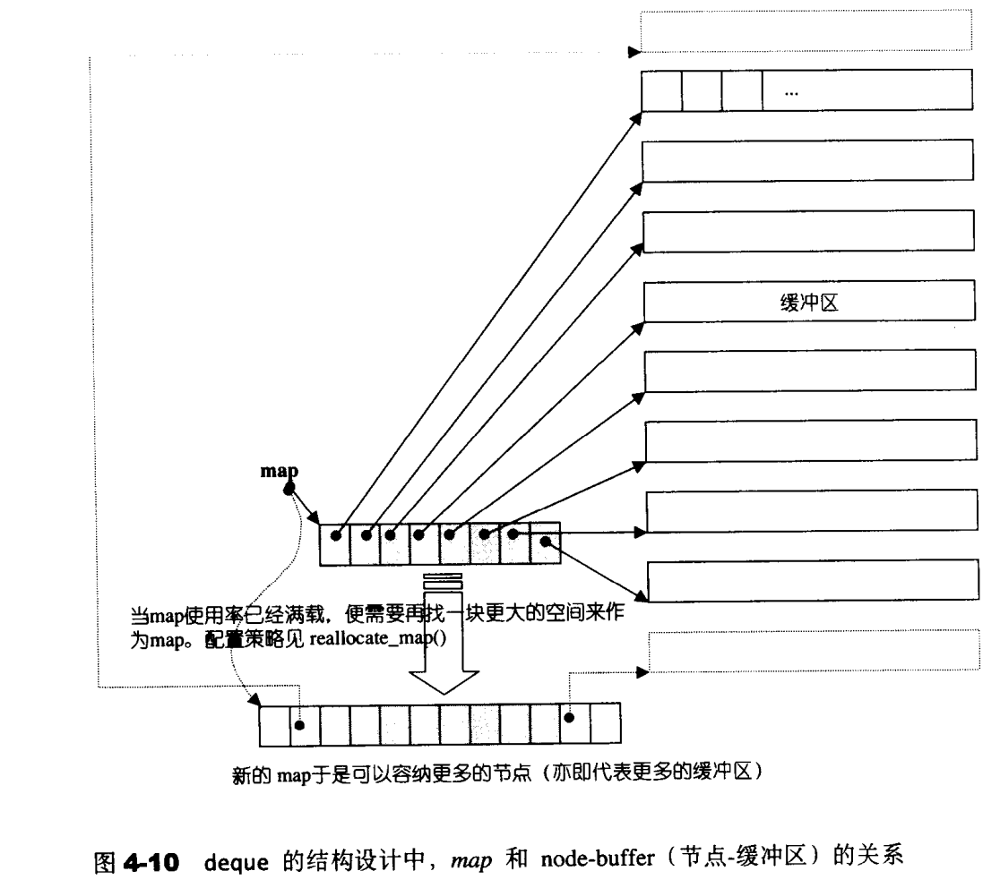

- [deque概述](#deque概述)
  - [deque常见操作的复杂度](#deque常见操作的复杂度)
- [deque的实现](#deque的实现)
- [deque的迭代器](#deque的迭代器)
  - [迭代器的失效](#迭代器的失效)
- [参考](#参考)

# deque概述

deque（ double-ended queue ，双端队列）是有下标的顺序容器，可以在首位两端快速插入或删除数据。与vector的连续空间存储不同，deque的元素可能不是相邻存储的

vecotr也允许在头尾两端添加或删除数据，但可能会涉及到元素的移动和扩容，导致效率不高

deque的迭代器也提供随机存储功能，但与vector的迭代器是普通指针不同，为了实现随机存取，deque的迭代器实现比较复杂

deque的存储按需自动扩展及收缩。deque的扩容相比vector更优，它既不会涉及到元素的移动，也不会过多的浪费存储空间

## deque常见操作的复杂度

- 随机访问——常数 O(1)
- 在结尾或起始插入或移除元素——常数 O(1)
- 插入或移除元素——线性 O(n)

# deque的实现

deque由一段一段固定大小的连续空间组成，扩容时，便在deque的首或尾新增一个固定大小的连续空间，这就需要额外的结构来串联起这一段段的固定大小空间

同时为了实现随机存取的接口，则实现了复杂的迭代器架构

deque采用的是两层架构，采用map（与STL的map不同），记录有多少个固定的连续空间，其中的每个元素称为节点缓冲区，存储实际的元素。

有的实现我们可以指定固定缓冲区的大小

这就意味着为了访问真实的元素，必须先定为到节点缓冲区，然后再定位到元素本身，需要进行两次指针访问，而vector只需要一次指针访问

map中的节点缓冲区满时，需要重新分配map本身的区域，移动原有的节点缓冲区到新的map区域，但这代价很小，仅仅是移动指针而已



deque的数据结构如下

```cpp
template <typename T>
class deque {
 public:
  typedef T value_type;
  typedef value_type* pointer;
  typedef pointer* map_pointer;

 private:
  map_pointer map; // 记录节点缓冲区
  size_type map_size; // map可以容纳多少个缓冲区
};
```

# deque的迭代器

通过deque的结构可以知道，deque的迭代器至少需要保存两个信息：当前元素在哪个节点缓冲区；当前元素在这个缓冲区的哪个位置

如可能的结构如下

```cpp
class deque_iterator {
 public:
  Self& operator++() {
      ++cur;
      if (cur == last) { // 到达该节点缓冲区的尾部就切换到下一个缓冲区
        set_node(node + 1);
        cur = first;
      }
      return *this;
  }  

 private:
  T* cur; // 当前元素
  T* first; // 当前节点缓冲区的第一个元素
  T* last; // 当前节点缓冲区的尾，包含备用空间
  map_pointer node; // 指向管控中心
};
```

## 迭代器的失效

- 在队列中间的插入操作导致所有迭代器和引用失效——可能涉及到元素移动或map中控器扩容
- 在队列头尾插入操作会导致迭代器失效——可能涉及map中控器扩容，但不会非法化引用
- 在队列中间擦除操作导致所有迭代器和引用失效——涉及元素移动
- 在队列头尾擦除操作导致擦除元素的迭代器失效（在尾部删除还会导致end迭代器失效），但不会非法化未擦除元素的引用

# 参考

- [容器库](https://zh.cppreference.com/w/cpp/container/deque)
- [STL源码剖析](https://item.jd.com/11821611.html)
