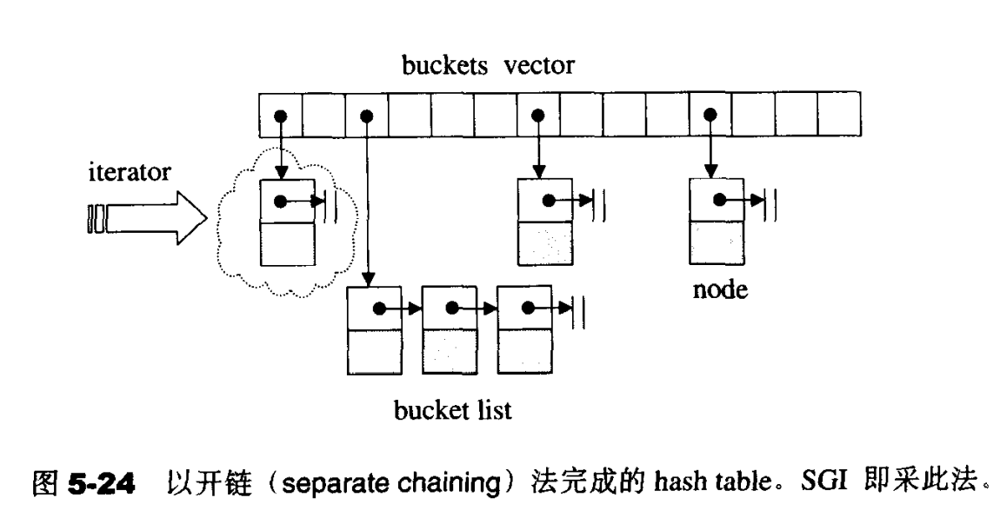

- [无序关联容器](#无序关联容器)
- [无序关联容器的实现](#无序关联容器的实现)
- [迭代器失效](#迭代器失效)
- [无序关联式容器的注意事项](#无序关联式容器的注意事项)
- [参考](#参考)

# 无序关联容器

无序关联容器提供能快速查找（均摊 O(1) ，最坏情况 O(n) 的复杂度）的无序（哈希）数据结构。

无序关联容器有以下几种

- unordered_set：无序集合，键唯一
- unordered_map：无序键值对集合，键唯一
- unordered_multiset：无序集合，键不唯一
- unordered_multimap：无序键值对集合，键不唯一

# 无序关联容器的实现

无序关联容器的内部由哈希表实现，哈希表使用哈希函数确定元素所在桶(bucket)的位置

由于桶的数量是有限的，因此会出现哈希碰撞的问题，即不同的元素存储在相同的桶中，如果哈希函数或者解决碰撞的方法不好，可能会导致哈希表退化为一个链表

哈希表的实现中，会提供两个函数insert_unique和insert_equal分别来实现unordered_set/unordered_map和unordered_multiset/unordered_multimap

由于实现的特性，无序关联式容器是无序的

# 迭代器失效

- 无重新哈希：无序关联容器的迭代器和引用除了元素被删除外不会被非法化（包括end迭代器）
- 插入元素导致重新哈希：迭代器（包括end迭代器）非法化，引用有效

# 无序关联式容器的注意事项

- unordered_map的operator[]可能会新增元素
- 无序关联式容器的元素没有顺序
- 删除元素时注意迭代器失效的问题；代码`unordered_map.erase(it); it++;`是错误的
- 无法通过迭代器修改键值，但可以修改unordered_map/unordered_multimap的value值

# 参考

- [容器库](https://zh.cppreference.com/w/cpp/container)
- [STL源码剖析](https://item.jd.com/11821611.html)
